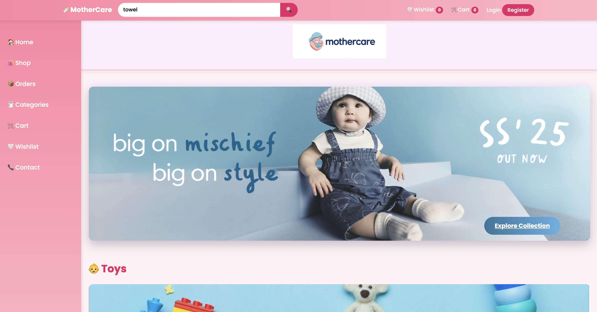
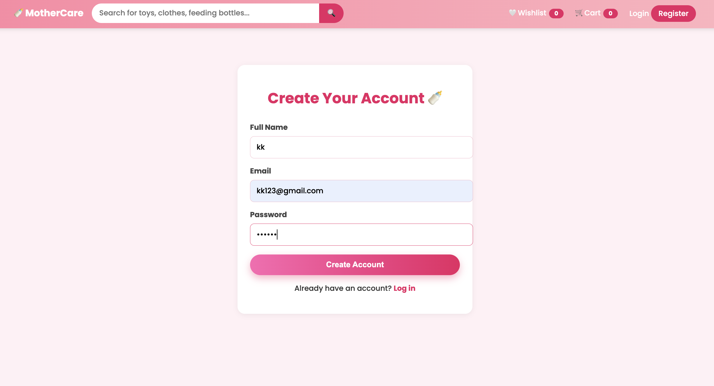
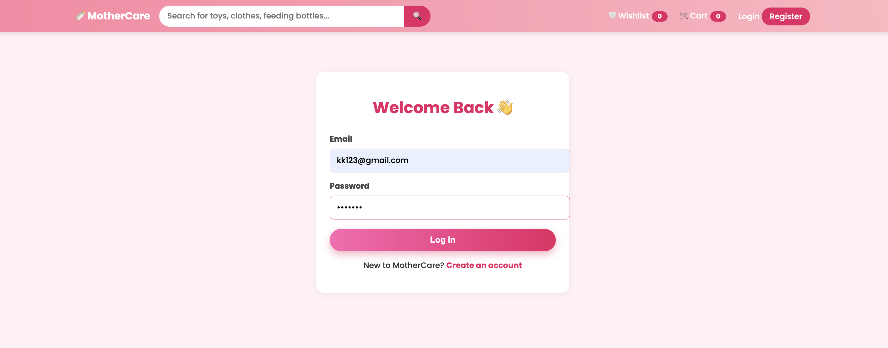
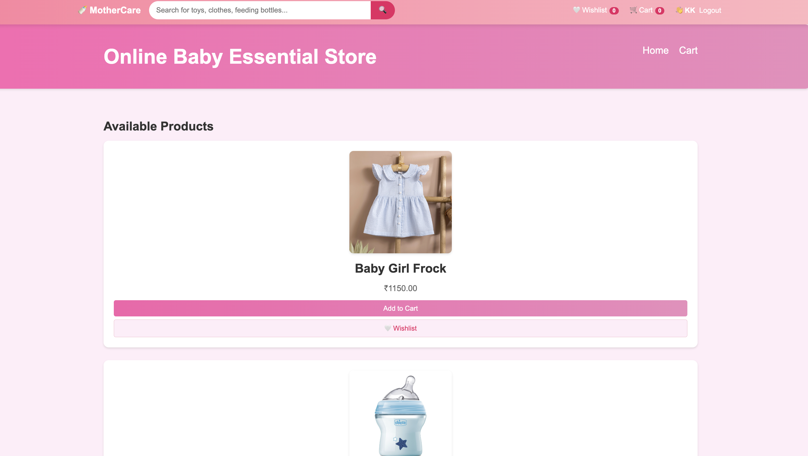
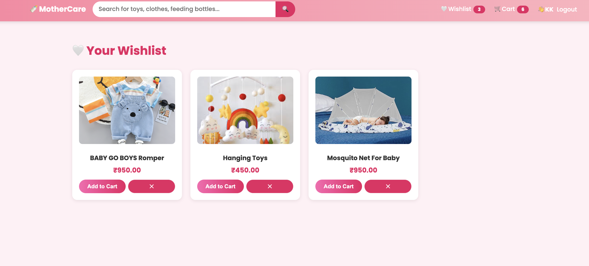
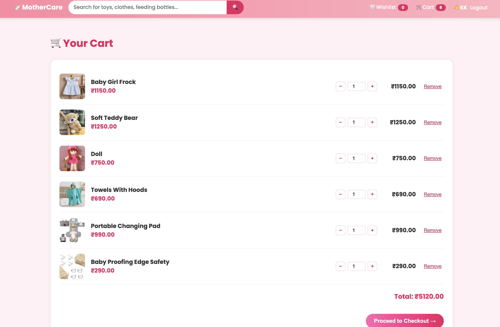
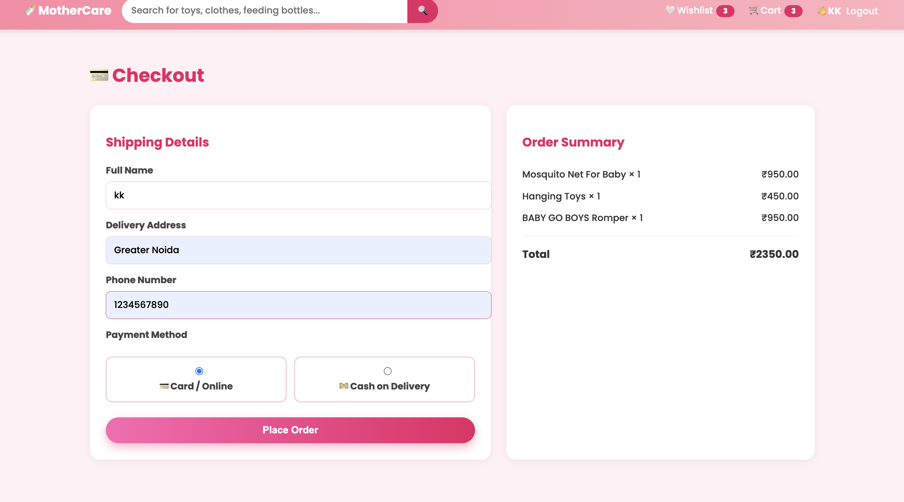
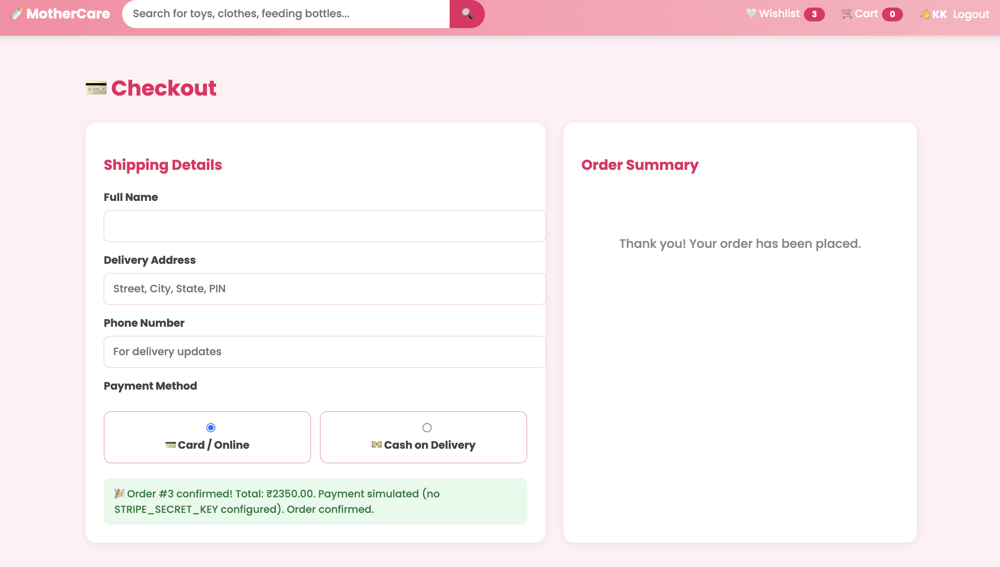
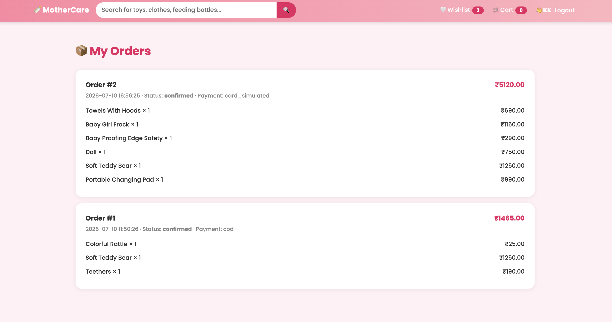
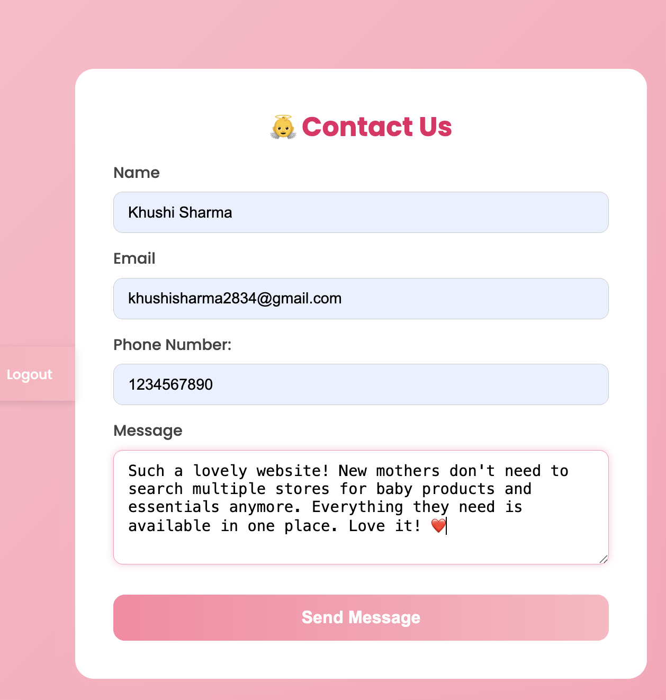

# MotherCare - Full Stack E-Commerce Website


A full-stack e-commerce web application for baby and mom essentials, built using **HTML, CSS, JavaScript, Node.js, Express.js, and SQLite**. The application allows users to browse products, register/login securely, manage their shopping cart and wishlist, and place orders through a responsive and user-friendly interface.

---

## 🚀 Features

- 👤 User Registration & Login
- 🔐 JWT Authentication
- 🔒 Password Encryption using bcrypt
- 🛍️ Browse Products by Category
- 🔎 Product Search
- ❤️ Wishlist Management
- 🛒 Shopping Cart
- 💳 Checkout Process
- 📦 Order Management
- 📱 Responsive Design
- 🌐 REST API Integration
- 🗄️ SQLite Database

---

## 🛠️ Tech Stack

### Frontend
- HTML5
- CSS3
- JavaScript

### Backend
- Node.js
- Express.js

### Database
- SQLite

### Authentication
- JWT (JSON Web Token)
- bcrypt

### Other Tools
- dotenv
- CORS
- Stripe (Optional Payment Integration)

---

# 📸 Project Screenshots

## 🏠 Home Page



---

## 📝 Registration Page



---

## 🔐 Login Page



---

## 🛍️ Products Page



---

## ❤️ Wishlist



---

## 🛒 Shopping Cart



---

## 💳 Checkout - Step 1



---

## 💳 Checkout - Step 2



---

## 📦 My Orders



---

## 📞 Contact Page



---

## 📂 Project Structure

```text
MotherCare-FullStack/
│
├── frontend/
│   ├── HTML Files
│   ├── CSS/
│   └── JavaScript/
│
├── backend/
│   ├── routes/
│   ├── middleware/
│   ├── data/
│   ├── server.js
│   ├── db.js
│   ├── seed.js
│   └── package.json
│
├── Screenshots/
│
└── README.md
```

---

## 🗄️ Database

This project uses **SQLite** as the database.

Database File:

```text
backend/data/mothercare.db
```

Database Tables:

- Users
- Products
- Shopping Cart
- Wishlist
- Orders

---

## ⚙️ Installation & Setup

### 1️⃣ Clone the Repository

```bash
git clone https://github.com/Khushi-Sharma-0/mothercare-fullstack-ecommerce.git
```

### 2️⃣ Open the Project

```bash
cd mothercare-fullstack-ecommerce
```

### 3️⃣ Install Dependencies

```bash
cd backend
npm install
```

### 4️⃣ Configure Environment Variables

Create a `.env` file inside the `backend` folder.

Example:

```env
JWT_SECRET=your_secret_key
STRIPE_SECRET_KEY=your_stripe_secret_key
```

### 5️⃣ Start the Backend Server

```bash
npm start
```

or

```bash
node server.js
```

### 6️⃣ Run the Frontend

Open the frontend using **Live Server** in Visual Studio Code or open the main HTML file in your browser.

---

## 🌐 API Modules

- Authentication
- Products
- Cart
- Wishlist
- Orders

---

## 🚀 Future Improvements

- Admin Dashboard
- Product Reviews & Ratings
- Online Payment Integration
- Order Tracking
- User Profile Management
- Email Notifications
- Inventory Management
- Product Recommendations

---

## 👩‍💻 Author

**Khushi Sharma**

Bachelor of Computer Applications (Artificial Intelligence & Machine Learning)

**GitHub:** https://github.com/Khushi-Sharma-0

**LinkedIn:** https://www.linkedin.com/in/khushi-sharma-200127304/

---

⭐ If you found this project helpful, consider giving it a **Star** on GitHub.
